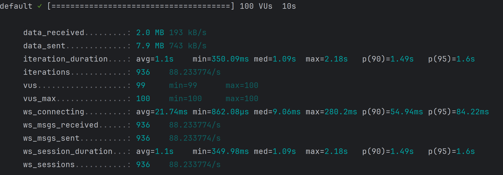
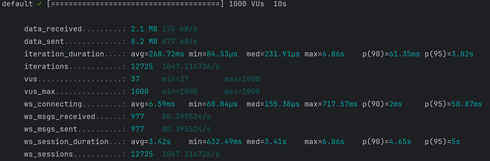

# 测试脚本

```shell
k6 run --duration 10s --vus 1000 k6_websocket_test.js
```

## 1. 调整 WebSocket 的 read buffer 和 write buffer 设置
大小512


大小1024


大小2048


## 2. 调整请求和响应的大小。
大小512


大小1024


大小2048


## 3. 调整并发数

200


500


100



2000


1000




