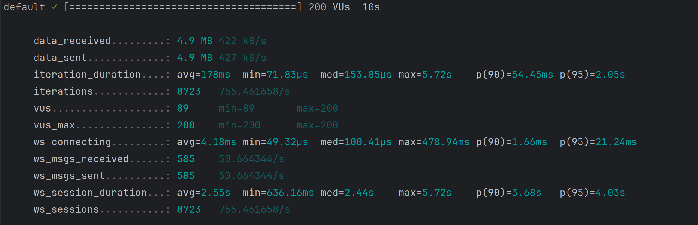
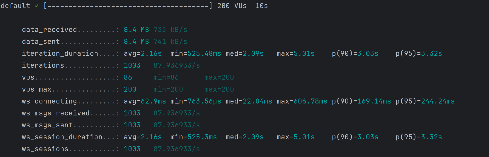
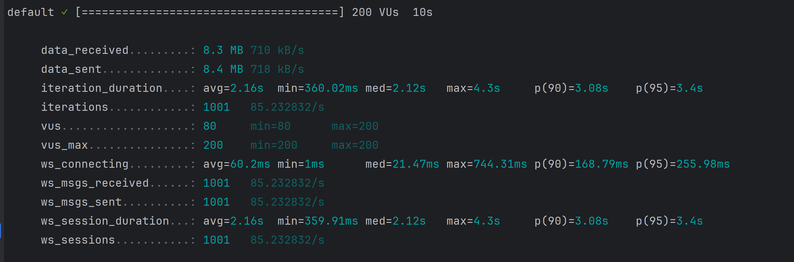
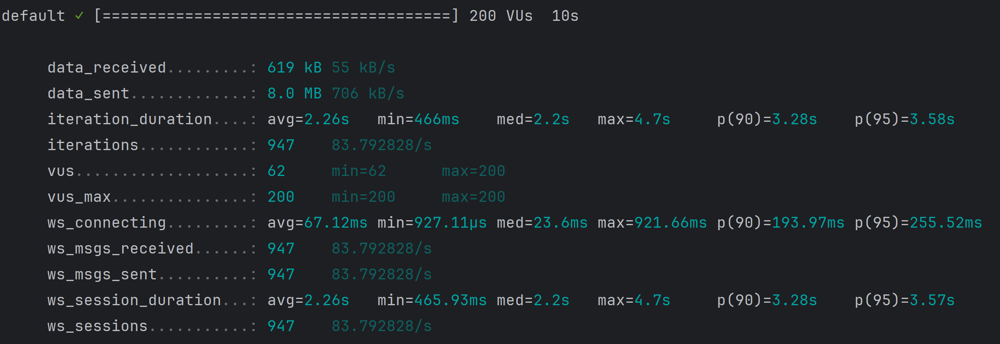
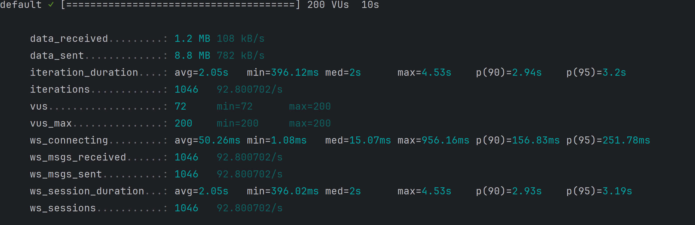
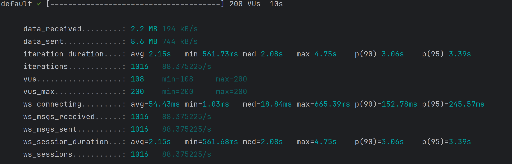
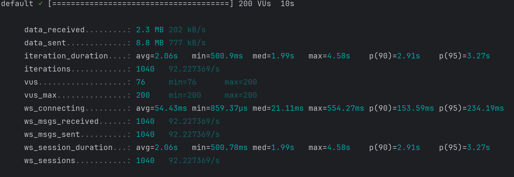
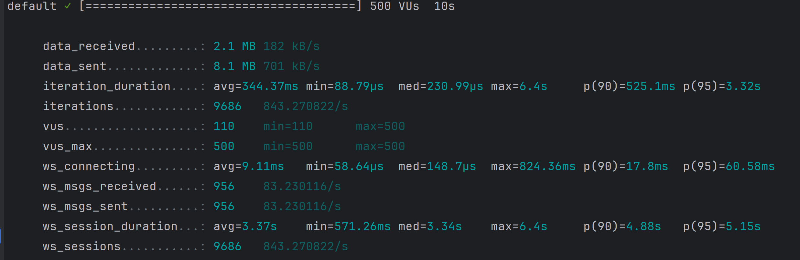
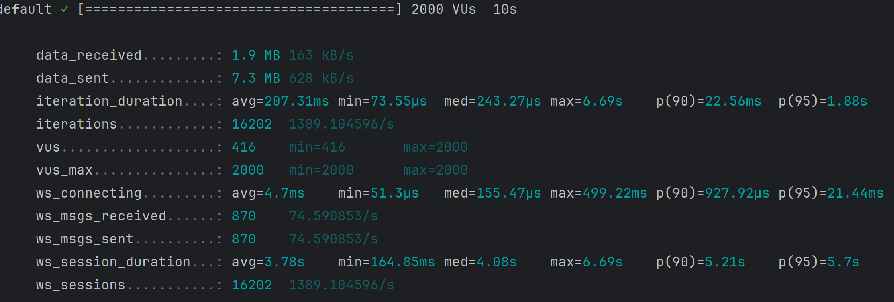

# 测试脚本

```shell
k6 run --duration 10s --vus 1000 k6_websocket_test.js
```

## 1. 调整 WebSocket 的 read buffer 和 write buffer 设置
大小512



大小1024



大小2048



其它参数
| 参数   | 值        |
|------|----------|
| 并发数  | 200      |
| 请求大小 | 2048 Byte |
| 响应大小 | 2048 Byte |

| ReadBufferSize | WriteBufferSize | ws_sessions | ws_connecting avg | ws_connecting p(95) | ws_session_duration avg | ws_session_duration p(95) |
|----------------|-----------------|-------------|-------------------|---------------------|-------------------------|---------------------------|
| 512            | 512             | 8723        | 4.18ms            | 21.24ms             | 158ms                   | 2.55s                     |
| 1024           | 1024            | 1003        | 62.9ms            | 244.24ms            | 168.6ms                 | 2.16s                     |
| 2048           | 2048            | 1001        | 60.2ms            | 255.98ms            | 163ms                   | 2.16s                     |

## 结果分析
修改 ReadBufferSize 和 WriteBufferSize 的值对性能影响不大。

## 2. 调整请求和响应的大小。
大小512



大小1024



大小2048



### 其他参数

| 参数              | 值    |
|-----------------|------|
| 并发数             | 200  |
| ReadBufferSize  | 1024 |
| WriteBufferSize | 1024 |

### 测试结果

| 请求大小（Byte） | 响应大小（Byte） | ws_sessions | ws_connecting avg | ws_connecting p(95) | ws_session_duration avg | ws_session_duration p(95) |
|------------|------------|-------------|-------------------|---------------------|-------------------------|---------------------------|
| 512        | 512        | 947         | 67.12ms           | 255.52ms            | 2.26s                   | 3.57s                     |
| 1024       | 1024       | 1046        | 50.26ms           | 251.78ms            | 2.05s                   | 3.19s                     |
| 2048       | 2048       | 1016        | 54.43ms           | 254.57ms            | 2.15s                   | 3.39s                     |

### 结果分析

请求和响应的大小增加后，连接的建立时间只有少量增加。和而连接的持续时间因为需要更多的时间来传递数据，所以有明显的增长。


## 3. 调整并发数

200



500




2000



| 参数              | 值         |
|-----------------|-----------|
| ReadBufferSize  | 1024      |
| WriteBufferSize | 1024      |
| 请求大小            | 2048 Byte |
| 响应大小            | 2048 Byte |

### 测试结果

| 并发数  | ws_sessions | ws_connecting avg | ws_connecting p(95) | ws_session_duration avg | ws_session_duration p(95) |
|------|-------------|-------------------|---------------------|-------------------------|---------------------------|
| 200  | 1040        | 54.43ms           | 234.19ms            | 2.06s                   | 3.27s                     |
| 500  | 9686        | 9.11ms            | 60.58ms             | 3.37s                   | 5.15s                     |
| 2000 | 16202       | 4.7ms             | 21.44ms             | 3.78s                   | 5.7s                      |


