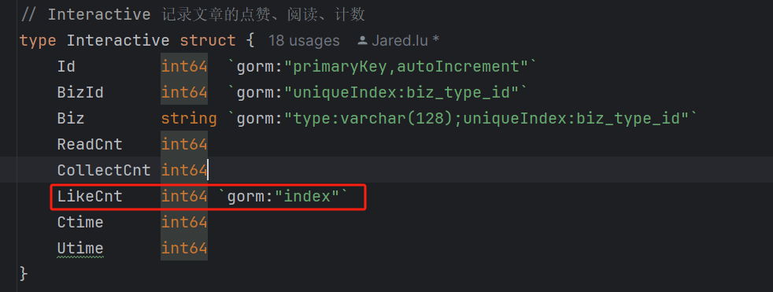
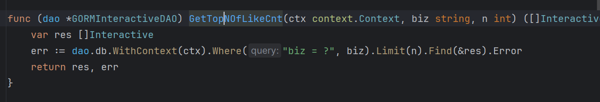
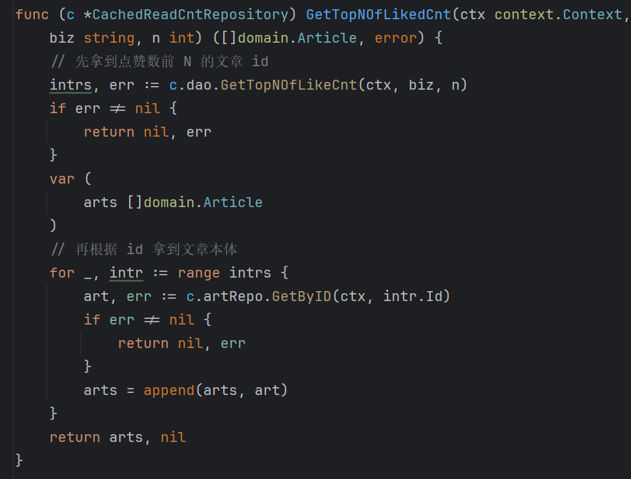

我采用的方法：直接在LikeCnt上建立索引，每次需要的时候直接数据库查找，适合数据量小和并发不高的场景
代码地址：
https://github.com/Jared-lu/webook/blob/homework/webook/internal/repository/interactive.go
https://github.com/Jared-lu/webook/blob/homework/webook/internal/repository/dao/interactive.go

